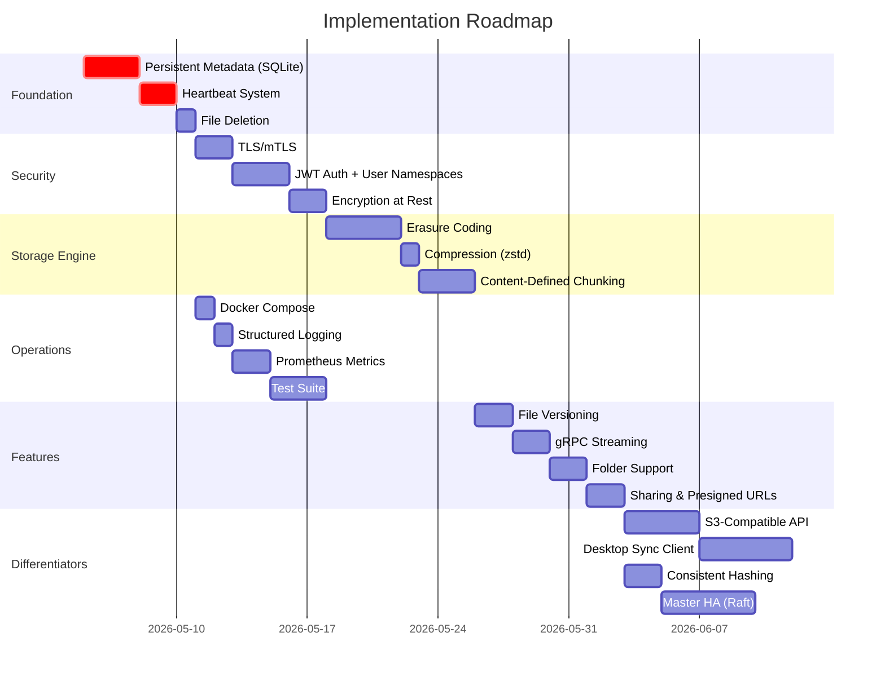

# 🚀 Mini-Dropbox → Industry-Grade Distributed Storage

> **Goal**: Transform this from a solid academic demo into a portfolio project that makes engineers say *"wait, you built this?"*

---

## 📊 Current State Assessment

| Area | Current | Industry Standard |
|------|---------|-------------------|
| **Metadata** | In-memory dicts (lost on restart) | Persistent DB with WAL |
| **Security** | `insecure_channel` everywhere | mTLS + auth + encryption at rest |
| **Storage Engine** | Raw file writes | Erasure coding, compression, tiering |
| **Observability** | `print()` statements | Structured logs, metrics, tracing |
| **Scalability** | Hardcoded 2 nodes | Dynamic cluster with auto-rebalancing |
| **API** | Basic CRUD | Versioning, sharing, presigned URLs |
| **Fault Tolerance** | Simple failover | Heartbeats, auto-repair, quorum writes |
| **Frontend** | Functional dashboard | Real-time, drag-drop, previews |

---

## 🏗️ Phase 1 — Fix the Foundation (Priority: CRITICAL)

### 1.1 Persistent Metadata Store

**Problem**: All metadata lives in Python dicts. Restart master = lose everything.

**Build**:
- Replace `file_manifest` / `chunk_locations` / `storage_nodes` with **SQLite** (simple) or **etcd** (production-grade)
- Add a **Write-Ahead Log (WAL)** so the master can recover from crashes
- Store: file manifests, chunk→node mappings, node registry, file metadata (size, timestamps, owner)

```
# New schema (SQLite)
files:        id | filename | owner | size | created_at | updated_at | checksum
chunks:       id | file_id  | chunk_index | chunk_hash | size
chunk_replicas: chunk_id | node_id | verified_at | status
nodes:        id | node_id  | host | port | status | last_heartbeat | capacity_bytes | used_bytes
```

**Why it stands out**: Every interviewer will ask *"what happens when you restart?"* — having WAL recovery is a killer answer.

---

### 1.2 Node Health & Heartbeat System

**Problem**: Master has zero idea if a storage node has died. It keeps routing to dead nodes.

**Build**:
- Storage nodes send **heartbeats** every 5s via a new `Heartbeat` RPC
- Master marks nodes `ALIVE` / `SUSPECT` / `DEAD` based on missed heartbeats
- Dead nodes get excluded from `RequestPutTargets` and `RequestGetTargets`
- Add a `NodeStatus` RPC so clients/dashboard can see node health

```protobuf
// New RPCs
rpc Heartbeat(HeartbeatRequest) returns (HeartbeatResponse);
rpc GetClusterHealth(Empty) returns (ClusterHealthResponse);

message HeartbeatRequest {
  string node_id = 1;
  int64 used_bytes = 2;
  int64 free_bytes = 3;
  int32 chunk_count = 4;
}
```

---

### 1.3 File Deletion

**Problem**: You can upload and download, but never delete. Files accumulate forever.

**Build**:
- `DeleteFile` RPC on master → removes manifest, issues `DeleteChunk` to storage nodes
- Reference counting on chunks (for dedup — don't delete a chunk still referenced by another file)
- Soft-delete with a trash/recycle bin (30-day retention before permanent purge)

---

## 🔒 Phase 2 — Security (Priority: HIGH)

### 2.1 Transport Security (mTLS)

Replace every `insecure_channel` with TLS:
- Generate CA cert, server certs, client certs
- Mutual TLS so nodes authenticate each other
- This is a **massive** differentiator — most student projects skip security entirely

### 2.2 Authentication & Authorization

- Add **JWT-based auth** to the FastAPI layer
- User registration/login endpoints
- Per-user file namespaces (users only see their own files)
- Role-based access: `admin` (manage nodes) vs `user` (upload/download)

### 2.3 Encryption at Rest

- Encrypt chunks before writing to disk using **AES-256-GCM**
- Key management: derive per-file keys from a master key + file ID
- Client-side encryption option (zero-knowledge mode — server never sees plaintext)

---

## ⚡ Phase 3 — Advanced Storage Engine (Priority: HIGH)

### 3.1 Erasure Coding (Reed-Solomon)

**This is the #1 feature that will make your project stand out.**

Instead of storing 2 full copies (2× storage overhead), use erasure coding:
- Split each file into `k` data shards + `m` parity shards
- Can tolerate `m` node failures while using only `(k+m)/k` storage (e.g., 1.5× instead of 2×)
- Use the `pyeclib` or `zfec` library

```
Current:  1MB file → 2MB stored (2 full copies)
With EC:  1MB file → 1.5MB stored (4 data + 2 parity shards), tolerates 2 failures
```

### 3.2 Compression

- Compress chunks with **zstd** (best ratio/speed tradeoff) before storing
- Content-aware: skip compression for already-compressed formats (.jpg, .mp4, .zip)
- Track compression ratio in metadata for analytics

### 3.3 Content-Aware Chunking (CDC)

Replace fixed 64KB chunking with **Content-Defined Chunking** (Rabin fingerprinting):
- Chunks split at content boundaries, not fixed offsets
- Dramatically improves dedup for files that change slightly (e.g., edited documents)
- This is what Dropbox, Restic, and Borg actually use

### 3.4 Storage Tiering

- **Hot tier**: SSD-backed nodes for frequently accessed files
- **Cold tier**: HDD-backed nodes for archival
- Auto-migration based on access patterns (LRU tracking)
- Expose tier info in the dashboard

---

## 🌐 Phase 4 — Real-Time & Advanced API (Priority: MEDIUM-HIGH)

### 4.1 gRPC Streaming for Large Files

Replace the current "one chunk per RPC" with **bidirectional streaming**:

```protobuf
rpc StreamUpload(stream UploadChunk) returns (UploadResult);
rpc StreamDownload(DownloadRequest) returns (stream DownloadChunk);
```

Benefits: single connection, flow control, progress tracking, 3-5× faster for large files.

### 4.2 File Versioning

- Every upload of the same filename creates a new version
- `ListVersions(filename)` → returns version history with timestamps
- `DownloadVersion(filename, version)` → download specific version
- Diff between versions (for text files)

### 4.3 File Sharing & Presigned URLs

- Generate **time-limited shareable links** (like S3 presigned URLs)
- Public/private sharing with optional password protection
- Share files with specific users

### 4.4 Folder Support & Virtual Filesystem

- Support hierarchical paths: `/photos/vacation/img001.jpg`
- `ListDirectory`, `CreateFolder`, `MoveFile`, `CopyFile` RPCs
- Tree view in the web UI

### 4.5 Resumable Uploads/Downloads

- Track upload progress server-side per session
- If connection drops, client resumes from the last confirmed chunk
- Critical for large files over unreliable networks

---

## 📈 Phase 5 — Observability & Ops (Priority: MEDIUM)

### 5.1 Structured Logging

Replace all `print()` with Python's `logging` module + **JSON structured logs**:

```python
import structlog
logger = structlog.get_logger()
logger.info("chunk_stored", chunk_id=cid, node_id=node_id, size_kb=size_kb, latency_ms=elapsed)
```

### 5.2 Prometheus Metrics

Expose metrics at `/metrics` on each node:

| Metric | Type | Description |
|--------|------|-------------|
| `chunks_stored_total` | Counter | Total chunks written |
| `chunk_store_duration_seconds` | Histogram | Write latency distribution |
| `storage_used_bytes` | Gauge | Disk usage per node |
| `replication_lag_seconds` | Gauge | Time since last successful replication |
| `grpc_requests_total` | Counter | RPC call count by method |
| `active_connections` | Gauge | Current gRPC connections |

### 5.3 Distributed Tracing (OpenTelemetry)

- Trace a single upload across client → master → storage nodes
- Visualize with **Jaeger** — shows exactly where time is spent
- This is incredibly impressive in a portfolio project

### 5.4 Admin Dashboard Upgrades

- **Real-time WebSocket** updates (node health, upload progress)
- **Chunk distribution heatmap** — visual of which nodes hold what
- **Bandwidth/throughput graphs** over time
- **Audit log** — who uploaded/downloaded/deleted what and when

---

## 🔄 Phase 6 — Scalability & Reliability (Priority: MEDIUM)

### 6.1 Dynamic Node Discovery

- Nodes register/deregister dynamically (current code already supports register)
- Auto-rebalancing: when a new node joins, migrate chunks to balance load
- When a node leaves, re-replicate its chunks to maintain replication factor

### 6.2 Consistent Hashing for Chunk Placement

Replace the naive "first 2 nodes" strategy:

```python
# Current (fragile)
targets = storage_nodes[:2]

# Industry standard: consistent hashing
ring = ConsistentHashRing(storage_nodes)
targets = ring.get_nodes(chunk_id, replicas=replication_factor)
```

Benefits: adding/removing nodes only moves ~1/N of data.

### 6.3 Quorum Writes & Reads

- **Write quorum**: W out of N replicas must confirm before success
- **Read quorum**: R replicas consulted, latest version wins
- Configurable consistency: `W + R > N` for strong consistency

### 6.4 Master HA (Leader Election)

- Single master = single point of failure
- Implement **Raft consensus** for master replication (use `PySyncObj`)
- Automatic leader election if master crashes
- This alone puts you in the top 1% of student projects

---

## 🎨 Phase 7 — Developer & User Experience (Priority: MEDIUM)

### 7.1 Python SDK / CLI Overhaul

```python
# Pip-installable SDK
from minidropbox import Client

client = Client("localhost:9000", token="...")
client.upload("report.pdf", path="/documents/")
client.download("report.pdf", version=2)
client.share("report.pdf", expires_in=3600)

for f in client.list("/documents/"):
    print(f.name, f.size, f.versions)
```

### 7.2 Docker Compose One-Click Deploy

```yaml
# docker-compose.yml
services:
  master:
    build: .
    command: python -m master.master
    ports: ["9000:9000"]
  
  node1:
    build: .
    command: python -m storage_node.storage_node --id node1 --port 9001 --store /data
    volumes: ["node1_data:/data"]
  
  node2:
    build: .
    command: python -m storage_node.storage_node --id node2 --port 9002 --store /data
    volumes: ["node2_data:/data"]
  
  api:
    build: .
    command: uvicorn web_api.server:app --host 0.0.0.0 --port 8000
    ports: ["8000:8000"]
  
  web:
    build: ./web
    ports: ["5173:5173"]
  
  prometheus:
    image: prom/prometheus
  
  grafana:
    image: grafana/grafana
```

### 7.3 Comprehensive Test Suite

- **Unit tests**: Each RPC handler, chunking logic, hash verification
- **Integration tests**: Full upload→download cycle, node failure simulation
- **Chaos tests**: Kill nodes mid-upload, network partition simulation
- **Benchmarks**: Throughput under load, latency percentiles (p50/p95/p99)
- Use `pytest` + `pytest-benchmark` + `grpcio-testing`

### 7.4 Web UI Enhancements

- **Drag-and-drop upload** with animated progress bar
- **File previews** (images, text, PDF inline viewer)
- **Real-time node health** via WebSocket (pulsing indicators)
- **Dark/light theme** toggle
- **Storage usage donut charts** per node
- **Upload history timeline**
- **Chunk visualization** — see how your file is distributed across nodes

---

## 💎 Phase 8 — Standout Differentiators

These are features that go beyond "fixing gaps" — they make your project **genuinely unique**.

### 8.1 🧠 Intelligent Data Placement (ML-Based)

- Track access patterns per file (frequency, recency, time-of-day)
- Predict future access and pre-warm hot data on fast nodes
- Automatically demote cold data to archival storage
- Show the ML predictions in the dashboard

### 8.2 🔗 S3-Compatible API Gateway

- Implement a subset of the **AWS S3 API** (`PutObject`, `GetObject`, `ListBucket`)
- Existing S3 tools (`aws cli`, `boto3`, Cyberduck) work with your system
- This is the ultimate interoperability flex

### 8.3 📱 Desktop Sync Client (like real Dropbox)

- Background daemon that watches a local folder
- Auto-uploads new/changed files using filesystem events (`watchdog` library)
- Conflict detection and resolution for concurrent edits
- System tray icon with sync status

### 8.4 🌍 Geo-Distributed Replication

- Tag nodes with geographic regions
- Policy: "keep at least 1 replica in US-East and 1 in EU-West"
- Rack-awareness: don't put both replicas on the same physical machine
- Latency-aware routing: read from the closest replica

### 8.5 📊 Bandwidth Throttling & QoS

- Rate limiting per user/per API key
- Priority queues: premium users get faster uploads
- Throttle background replication to not impact user traffic

### 8.6 🔍 Full-Text Search

- Index text-based files (txt, pdf, docx) on upload
- Search endpoint: `GET /api/search?q=quarterly+report`
- Use **Whoosh** (pure Python) or **Elasticsearch**

### 8.7 🪝 Webhooks & Event System

- Users register webhooks for events: `file.uploaded`, `file.deleted`, `node.down`
- Pub/sub event bus internally (use Redis or in-memory)
- Enables building automations on top of your storage system

---

## 🗺️ Recommended Implementation Order



---

## 🎯 Impact Matrix

| Feature | Effort | Impressiveness | Interview Value |
|---------|--------|---------------|-----------------|
| Persistent metadata | Low | Medium | ⭐⭐⭐⭐ |
| Heartbeat system | Low | High | ⭐⭐⭐⭐ |
| mTLS | Medium | Very High | ⭐⭐⭐⭐⭐ |
| JWT auth | Medium | High | ⭐⭐⭐⭐ |
| **Erasure coding** | **High** | **Exceptional** | ⭐⭐⭐⭐⭐ |
| Docker Compose | Low | High | ⭐⭐⭐⭐ |
| Prometheus + Grafana | Medium | Very High | ⭐⭐⭐⭐⭐ |
| **Consistent hashing** | **Medium** | **Exceptional** | ⭐⭐⭐⭐⭐ |
| File versioning | Low | Medium | ⭐⭐⭐ |
| gRPC streaming | Medium | High | ⭐⭐⭐⭐ |
| **S3-compatible API** | **High** | **Exceptional** | ⭐⭐⭐⭐⭐ |
| **Master HA (Raft)** | **Very High** | **Legendary** | ⭐⭐⭐⭐⭐ |
| Desktop sync client | High | Very High | ⭐⭐⭐⭐ |
| Test suite + chaos | Medium | Very High | ⭐⭐⭐⭐⭐ |
| OpenTelemetry tracing | Medium | Very High | ⭐⭐⭐⭐ |

---

## 🏆 The "Top 5" If You Have Limited Time

If you can only pick 5 features, these give the maximum ROI:

1. **Persistent metadata + heartbeats** — fixes the #1 credibility gap
2. **Docker Compose** — instant "it just works" demo
3. **Consistent hashing** — proves you understand distributed systems theory
4. **Erasure coding** — the single most impressive feature you can add
5. **Prometheus metrics + Grafana dashboard** — visual proof of a production system

> [!TIP]
> With just these 5, your project goes from "student exercise" to "genuinely impressive systems project" — the kind that makes a senior engineer pause during an interview.
